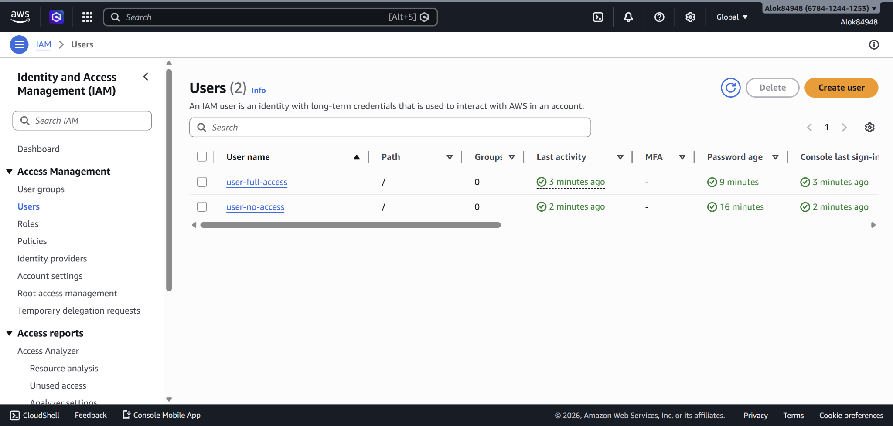

# Assignment 1

## 🌐 Deployed Link

http://13.63.116.161/

---

### 🔹 Website Output

---

## 📸 Screenshots

### 🔹 EC2 Instance (Running)

---

### 🔹 User 1 (No Access to EC2)

---

### 🔹 User 2 (Full Access to EC2)

---

## 👤 IAM Users Configuration

### User 1:

* Username: `user-no-access`
* Permissions: No permissions assigned
* Result: Cannot access EC2 (Access Denied)

### User 2:

* Username: `user-full-access`
* Permissions: `AmazonEC2FullAccess`
* Result: Can view and manage EC2 instances

---
