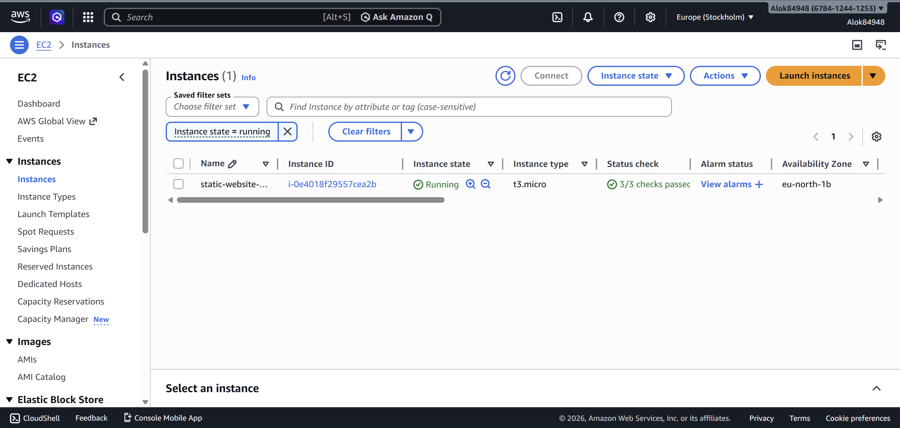
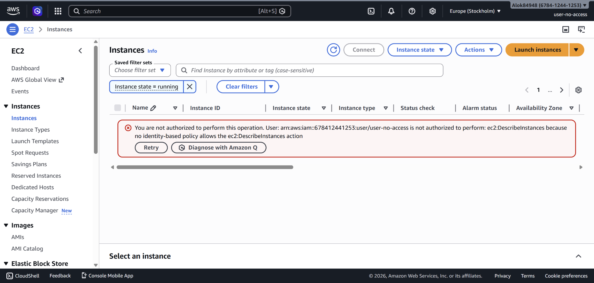
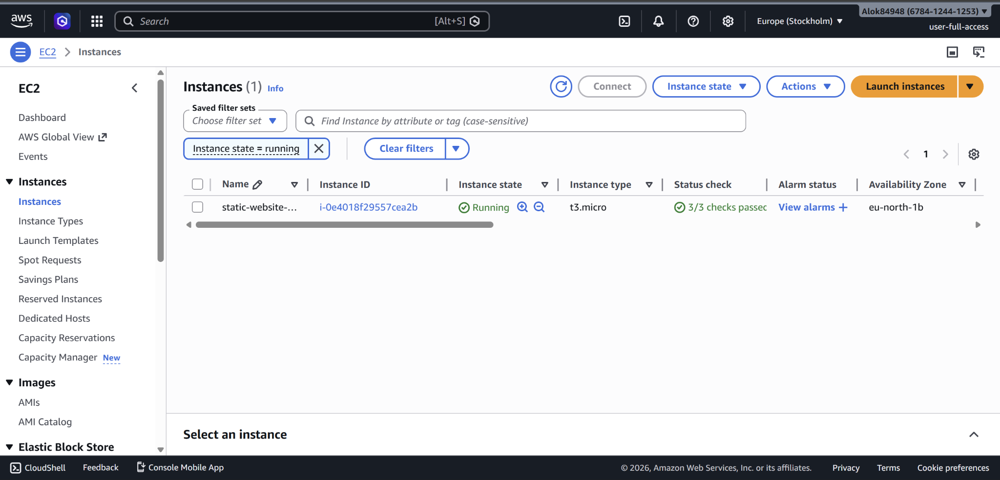

# Assignment 1

## 🌐 Deployed Link

http://56.228.59.250

---

## 📸 Screenshots

### 🔹 EC2 Instance (Running)

---

### 🔹 User 1 (No Access to EC2)

---

### 🔹 User 2 (Full Access to EC2)

---

### 🔹 Website Output

---

## 👤 IAM Users Configuration

### User 1:

* Username: `user-no-access`
* Permissions: No permissions assigned
* Result: Cannot access EC2 (Access Denied)

### User 2:

* Username: `user-full-access`
* Permissions: `AmazonEC2FullAccess`
* Result: Can view and manage EC2 instances

---

## ⚠️ Challenges Faced

* Confusion between Public IP and Elastic IP
* Website initially worked on Public IP instead of Elastic IP
* IAM login issues due to incorrect credentials
* Fixed by associating Elastic IP and resetting password

---

## 🛠️ Technologies Used

* AWS EC2 (Ubuntu)
* Apache Web Server
* IAM
* HTML/CSS/JS

---

## 🚀 Steps Performed

1. Launched EC2 instance (Ubuntu)
2. Installed Apache Web Server
3. Deployed static website
4. Allocated and associated Elastic IP
5. Created IAM users with different permissions
6. Verified access control
